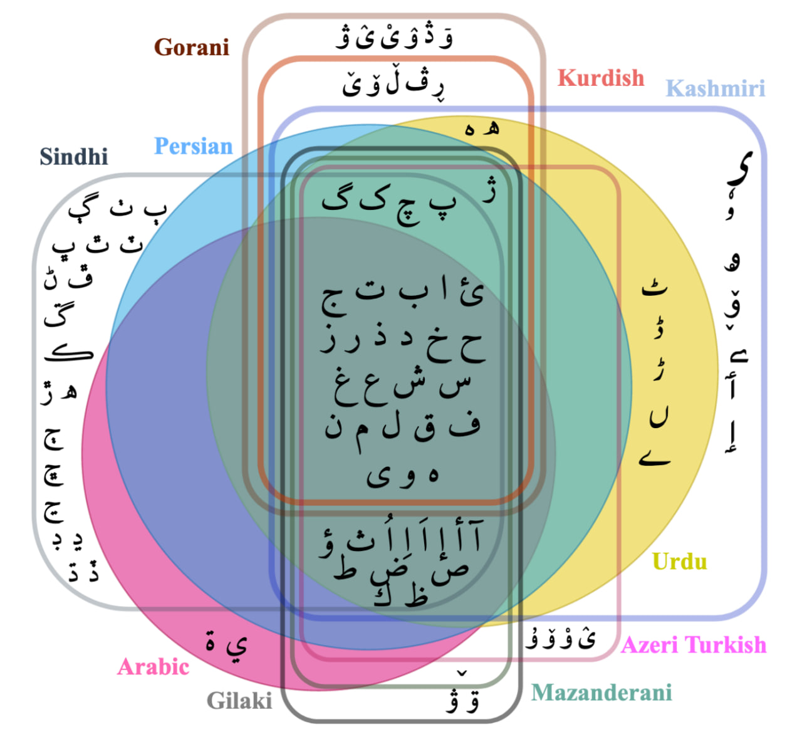

# Script Normalization for Unconventional Writing

<p align="center">
    <a href="">
        
    </a>
    <a href="https://sinaahmadi.github.io/docs/articles/ahmadi2023acl.pdf">
        [📑 ALC 2023 Paper] 
    </a>
    <a href="https://sinaahmadi.github.io/docs/slides/ahmadi2023acl_slides.pdf">
        [📝 Slides]
    </a>
    <a href="https://s3.amazonaws.com/pf-user-files-01/u-59356/uploads/2023-06-04/rw32pwp/ACL2023.mp4">
        [📽️ Presentation]
    </a>
    <a href="https://drive.google.com/file/d/1UPl41uqcaNS5QM940FlaFrZjfoZzx-Eq/view?usp=sharing">
        [📀 Datasets] 
    </a>
    <a href="https://huggingface.co/spaces/SinaAhmadi/ScriptNormalization](https://huggingface.co/spaces/SinaAhmadi/ScriptNormalization">
      [⚙️ Demo]
    </a>
</p>


This repository contains the data and the models described in the ACL2023 paper ["Script Normalization for Unconventional Perso-Arabic Writing"](https://sinaahmadi.github.io/docs/articles/ahmadi2023acl.pdf). The models are deployed on HuggingFace at [https://huggingface.co/spaces/SinaAhmadi/ScriptNormalization](https://huggingface.co/spaces/SinaAhmadi/ScriptNormalization) 🔥 

---

## What is unconventional writing?
<ul>
	<li>&quot;<em>mar7aba!</em>&quot;</li>
	<li>&quot;<em>هاو ئار یوو؟</em>&quot;</li>
	<li>&quot;<em>Μπιάνβενου α σε προζέ!</em>&quot;</li>
</ul>

What do all these sentences have in common? Being greeted in Arabic with &quot;<em>mar7aba</em>&quot; written in the Latin script, then asked how you are (&quot;<em>هاو ئار یوو؟</em>&quot;) in English using the Perso-Arabic script of Kurdish and then, welcomed to this demo in French (&quot;<em>Μπιάνβενου α σε προζέ!</em>&quot;) written in Greek script. All these sentences are written in an <strong>unconventional</strong> script.

Although you may find these sentences risible, unconventional writing is a common practice among millions of speakers in bilingual communities. In our paper entitled &quot;<a href="https://sinaahmadi.github.io/docs/articles/ahmadi2023acl.pdf" target="_blank"><strong>Script Normalization for Unconventional Writing of Under-Resourced Languages in Bilingual Communities</strong></a>&quot;, we shed light on this problem and propose an approach to normalize noisy text written in unconventional writing.

This repository provides codes and datasets that can be used to reproduce our paper or extend it to other languages. The focus of the current project is on some of the main languages that use a [Perso-Arabic script](https://en.wikipedia.org/w/index.php?title=Perso-Arabic_alphabet), namely the followings:

- [Azeri Turkish](https://en.wikipedia.org/wiki/Azerbaijani_language) (aka South Azerbaijani / `azb`)
- [Kashmiri](https://en.wikipedia.org/wiki/Kashmiri_language) (`kas`)
- [Gilaki](https://en.wikipedia.org/wiki/Gilaki_language) (`glk`)
- [Gorani](https://en.wikipedia.org/wiki/Gorani_language) (aka Hawrami, `hac`)
- [Northern Kurdish](https://en.wikipedia.org/wiki/Kurmanji) (aka Kurmanji, `kmr`)
- [Central Kurdish](https://en.wikipedia.org/wiki/Sorani) (aka Sorani, `ckb`)
- [Mazanderani](https://en.wikipedia.org/wiki/Mazanderani_language) (`mzn`)
- [Sindhi](https://en.wikipedia.org/wiki/Sindhi_language) (`snd`)
- [Persian](https://en.wikipedia.org/wiki/Persian_language) (`fas`)
- [Arabic](https://en.wikipedia.org/wiki/Modern_Standard_Arabic) (`arb`)
- [Urdu](https://en.wikipedia.org/wiki/Urdu) (`urd`)

**Please note that this project does not aim for spell-checking and cannot correct errors beyond character normalization**.

## Corpora
The data presented in the [`corpus`](data/corpus) folder have been extracted from Wikipedia dumps and cleaned using [wikiextractor](https://github.com/attardi/wikiextractor), unless the name of the file doesn't include `wiki` (followed by the date of the dump). Here are the sources of the material of the other languages:

 - Kurmanji (kmr-arb) contains crawled text collected from the following websites: [rojnameyaevro.com](rojnameyaevro.com), [www.gavtv.net](www.gavtv.net) and [https://badinan.org/](https://badinan.org/)
 - Gorani (hac-arb) is based on the [Zaza-Gorani corpus](https://github.com/sinaahmadi/ZazaGoraniCorpus).
 - Sorani (ckb-arb) is based on [Pewan](https://sinaahmadi.github.io/resources/pewan.html) and [AsoSoft corpus](https://github.com/AsoSoft/AsoSoft-Text-Corpus) corpora.

All the corpora are cleaned to a decent extent.


## Wordlists
Wordlists in the [`wordlist`](data/wordlist) folder contain words that are extracted from the corpora based on certain frequency. Depending on the size and quality of the data, the frequency is in the range of 3 to 10, i.e. words that appear with a frequency of 3 to 10 are extracted as the vocabulary of the language.

To extract words from the corpora, run the following:

	```
	cat <file> |  tr -d '[:punct:]' | tr " " "\n" | sort | uniq -c | sort -n > <file_wordlist>
	```

Following this, common words in the source and target languages are identified and stored in the [`common`](data/common) folder. For the target languages, dictionaries are used. This folder contains two sets of common words, whether written with the same spelling or slightly different, and is organized in two sub-folders: 

 - [`corpus-based`](data/common/corpus-based) contains files of common words in two languages based on a corpus
 - [`dictionary-based`](data/common/dictionary-based) contains files of common words in two languages extracted from dictionaries

If the source language has a dictionary, the common words are provided in the [`dictionary-based`](data/common/dictionary-based) folder. Otherwise, check the [`corpus-based`](data/common/corpus-based) folder. The merged vocabularies (based on corpus and dictionary) are provided in the [`common`](data/common) folder. If a dictionary is not available for the source language, the common files in [`common`](data/common) are the same as those at [`corpus-based`](data/common/corpus-based).

## Scripts
Information about the target scripts can be found at [`data/script`](data/script) as follows:

| Language | Target Script | Mapping |
|----------|---------------|---------|
| Kashmiri  |      Urdu   |  [`data/script/Kashmiri-Urdu.tsv`](data/script/Kashmiri-Urdu.tsv) |
| Sindhi    |      Urdu   |  [`data/script/Sindhi-Urdu.tsv`](data/script/Sindhi-Urdu.tsv) |
| Mazanderani    |      Persian   |  [`data/script/Mazanderani-Persian.tsv`](data/script/Mazanderani-Persian.tsv) |
| Gilaki    |      Persian   |  [`data/script/Gilaki-Persian.tsv`](data/script/Gilaki-Persian.tsv) |
| AzeriTurkish    |      Persian   |  [`data/script/AzeriTurkish-Persian.tsv`](data/script/AzeriTurkish-Persian.tsv) |
| Gorani    |      Kurdish   |  [`data/script/Gorani-Kurdish.tsv`](data/script/Gorani-Kurdish.tsv) |
| Gorani    |      Arabic   |  [`data/script/Gorani-Arabic.tsv`](data/script/Gorani-Arabic.tsv) |
| Gorani    |      Persian   |  [`data/script/Gorani-Persian.tsv`](data/script/Gorani-Persian.tsv) |
| Kurdish    |      Arabic   |  [`data/script/Kurdish-Arabic.tsv`](data/script/Kurdish-Arabic.tsv) |
| Kurdish    |      Persian   |  [`data/script/Kurdish-Persian.tsv`](data/script/Kurdish-Persian.tsv) |

Also, find more meta-data about the usage of diacritics and zero-width non-joiner (ZWNJ) in each language at [`data/script/info.json`](data/script/info.json). A mapping of all the scripts is also provided at [`data/scripts/scripts_all.tsv`](data/scripts/scripts_all.tsv).

## Character-alignment matrix (CAT)
Calculating the edit distance based on the wordlists, a character alignment matrix (CAT) is created for each source-target language pair. This matrix contains the normalized probability that a character in a language appears as the equivalent of another one in the other language, i.e. compare the letter '*ج*' in *بۆرج* in Azeri Turkish with	*برج* in Farsi. 

In addition to the edit distance, if there are rule-based mappings in the [`data/scripts`](data/scripts) folder, the CAT is updated accordingly (by adding 1 for each mapping). Finally, any replacement with a score < 0.1 is removed from the matrix.

## Datasets

The synthetic datasets are available on GDrive due to large size (2.39G in `.tar.gz`): [link](https://drive.google.com/file/d/1UPl41uqcaNS5QM940FlaFrZjfoZzx-Eq/view?usp=sharing). The real data in Central Kurdish written unconventionally in Arabic and Persian can be found at [`data/real`](data/real).

## Create your own pipeline!

If you are interested in this project and want to extend it, here are the steps to consider:

1. Add your corpus to the [`data/corpus`](data/corpus) folder
2. Update the [`code/config.json`](code/config.json) file and specify directories to your data and other required files.
3. Run [`extract_loanwords.py`](code/extract_loanwords.py) to extract common words (script should be optimized!)
4. Add script mapping in TSV format to the [`data/scripts`](data/scripts) folder.
5. Run [`create_CAT.py`](code/create_CAT.py) to create the character-alignment matrix
6. Run [`synthesize.py`](code/synthesize.py) to generate synthetic data. 

You can use any NMT training platform of your choice for training your models. In the paper, we use [joeynmt](https://github.com/joeynmt/joeynmt) for which the configuration files are provided in the [`training`](training/configs) folder. If using [SLURM](https://slurm.schedmd.com/), you can also use the scripts in [`training/SLURMs`](training/SLURMs).
 
## Cite this paper

If you use any part of the data, please consider citing **[this paper]()** as follows:

	@inproceedings{ahmadi2023acl,
    title = "Script Normalization for Unconventional Writing of Under-Resourced Languages in Bilingual Communities",
    author = "Ahmadi, Sina and Anastasopoulos, Antonios",
    month = july,
    year = "2023",
    address = "Tornonto, Cananda",
    publisher = "The 61st Annual Meeting of the Association for Computational Linguistics (ACL)"
	}


## License

[Apache License](https://github.com/sinaahmadi/KurdishMT/blob/master/LICENSE)